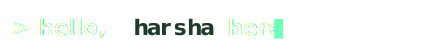

<!--
================================================================================
  README — harshagv · Terminal Phosphor v2.0
  Drop this file at:   harshagv/harshagv/README.md
  Companion assets:    src/banner/active-scan.svg
                       .github/workflows/snake.yml
  Palette:             #06080a bg · #52FFAA accent · #7FDCFF cyan · #D8F3DC text
================================================================================
-->

<!-- ============ HERO BANNER (capsule-render, gradient) ============ -->
<!-- 

  

 -->

<!-- 

 -->

<!-- ============ ACTIVE SCAN HEADLINE (custom SVG with SMIL) ============ -->

  

<!-- ============ TYPING ROLE ROTATOR ============ -->

  

<!-- ============ BRAND STATEMENT ============ -->
> Years in the digital trenches of **FinTech, Crypto & Banking**, 
> hardening multi-cloud (AWS/Azure) environments and containerized platforms,
> Specialized in Kubernetes security, secure SDLC enablement, 
> and building a pragmatic security posture from the ground up that remains resilient
> under adversarial pressure. My mission: fortify organizations and ensure their
> digital resilience in an ever-evolving threat landscape.
 

<!-- ============ FOCUS QUADRANT (currently exploring) ============ -->
### 🌱 Currently exploring · *Next-Generation Cloud-Native Security*

<table align="center">
  <tr>
    <td align="center" width="180">
      <b>eBPF</b> 
      runtime defense
    </td>
    <td align="center" width="180">
      <b>Agentic AI</b> 
      autonomous response
    </td>
    <td align="center" width="180">
      <b>PQC + FHE</b> 
      post-quantum privacy
    </td>
    <td align="center" width="180">
      <b>Blockchain</b> 
      immutable audit trails
    </td>
  </tr>
</table>

 

<!-- ============ STACK — grouped by function, not alphabet ============ -->
### Hands-on with

<table align="center">
  <tr>
    <td valign="top"><b>CLOUD</b></td>
    <td>
      
      
      
    </td>
  </tr>
  <tr>
    <td valign="top"><b>CONTAINERS &amp; IaC</b></td>
    <td>
      
      
      
      
      
      
    </td>
  </tr>
  <tr>
    <td valign="top"><b>SECURITY</b></td>
    <td>
      
      
      
      
      
    </td>
  </tr>
  <tr>
    <td valign="top"><b>OBSERVABILITY</b></td>
    <td>
      
      
      
      
      
    </td>
  </tr>
</table>

 

<!-- ============ CERTIFICATIONS ============ -->
### Credentials

<b>Certifications</b> &nbsp; · click to collapse

1. <a href="https://www.credly.com/badges/c74071e9-8c82-41f9-97fc-4f0809057d9b">ISC² Certified in Cybersecurity (CC)</a>
2. <a href="https://www.credly.com/badges/caa35793-d064-49be-8509-94685b90b26e">AWS Certified Security — Specialty</a>
3. <a href="https://www.credly.com/badges/70f4c532-01b6-41fc-85cd-05be931b6d67">AWS Certified Solutions Architect — Professional</a>
4. <a href="https://www.credly.com/badges/238268f2-9296-4d38-9a97-cf2c8c87cec6">AWS Certified DevOps Engineer — Professional</a>
5. <a href="https://www.credly.com/badges/f4ff4177-1d50-4ba3-9387-c2c193ea1033">CKS — Certified Kubernetes Security Specialist</a>
6. <a href="https://www.credly.com/badges/fff121e3-2158-4d11-bee4-7563344c9599">CKA — Certified Kubernetes Administrator</a>
7. <a href="https://www.credly.com/badges/d257f0c3-d1c0-4bf3-be03-f49e32715e58">KCNA — Kubernetes and Cloud Native Associate</a>
8. Scrum Alliance · <a href="https://badgecert.com/bc/html/profile.jsp?k=fdoihhc">Scrum Master</a> &amp; <a href="https://badgecert.com/bc/html/profile.jsp?k=xyhdzjz">Product Owner</a>

 

<!-- ============ FIND ME ============ -->
### Find me around the web

  
  
  
  
  
  
  
  

 

<!-- ============ GITHUB STATS (phosphor-graded) ============ -->
### GitHub stats

  <table align="center">
    <tr>
      <td colspan="2"></td>
    </tr>
    <tr>
      <td></td>
      <td></td>
    </tr>
    <tr>
      <td></td>
      <td></td>
    </tr>
  </table>

 

<!-- ============ CONTRIBUTION SNAKE ============ -->
<!-- ### A year of work

<picture>
  <source media="(prefers-color-scheme: dark)" srcset="https://raw.githubusercontent.com/harshagv/harshagv/output/snake-dark.svg" />
  <source media="(prefers-color-scheme: light)" srcset="https://raw.githubusercontent.com/harshagv/harshagv/output/snake.svg" />
  
</picture>

 
  -->

<!-- ============ FOOTER WAVE ============ -->

  

  <i>// thanks for stopping by · v2.0</i>

